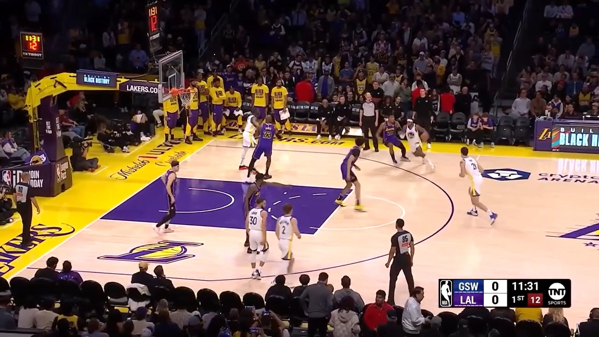

# 🧠 On-Prem Phi-3.5 Vision AI Agentic Metadata Enrichment on Images

A high-performance, on-premises FastAPI application that deploys agentic metadata enrichment on images using Microsoft's cutting-edge [Phi-3.5 Vision Instruct](https://huggingface.co/microsoft/Phi-3.5-vision-instruct) model and then pushes the enriched metadata to a mock Media Asset Management (MAM) client. Designed for local inference with GPU acceleration, modular and scalable Python architecture, and efficient model caching.

---

## 📚 Table of Contents
- [Introduction](#introduction)
- [Sample Output](#sample-output)
- [System Requirements](#system-requirements)
- [Running the App with Docker](#running-the-app-with-docker)

---

## Introduction

This app loads the Phi-3.5 Vision model once at startup and exposes an `/api/enrich` REST endpoint via FastAPI. You can send image files and asset IDs to the endpoint which then automatically deploys an agent that enriches the metadata (with a caption and tags) and then pushes that metadata to a mock MAM client.

Key features:

- 🤖 **Agentic Metadata Enrichment - the enrichment agent**:
  - Uses Phi-3.5 Vision to auto-caption a media image asset
  - Extracts relevant tags using keyword matching
  - Evaluates caption quality and auto-retries upon failure
  - Alters generation parameters on retry (`prompt`, `max_tokens`)
  - Logs a `reasoning_trace` to explain decisions
  - Automatically pushes enriched metadata to a MAM client

- 🧩 **Python and FastAPI - modular and scalable architecture**:
  - REST API, async I/O, singleton pattern model loading
  - Dependency Injection: services are injected using FastAPI’s `Depends()` pattern, making them modular, testable, and overrideable
  - Unit and full end-to-end integration testing
  - Test Mode for faster iteration: reduces image crops and generation length for accelerated development testing

- 🐳 **Containerization: Docker and Docker Compose**:
  - Fully containerized application with PyTorch and CUDA runtime base image
  - GPU-accelerated inference using `nvidia` runtime
  - Shares Hugging Face cache via mounted volume for efficient model loading
  - Environment variable control to quickly test different runtime configurations

---

## Sample Output 

Example image and asset id sent to the `/api/enrich` endpoint. Caption successful on initial attempt:



Response:
```jsonc
"[MAM] Updated asset nba_1 with metadata:"

{
  "caption": "The image captures a moment from a basketball game between the Los Angeles Lakers and the 
  Golden State Warriors. The players are in the midst of a play, with the Lakers in purple and the Warriors in white. 
  The crowd is visible in the background, and the game is being broadcasted on TNT.",
  "tags": ["sports"],
  "source": "phi3.5",
  "reasoning_trace": [
    "Caption generated using visual features and prompt context."
  ]
}
```

Example image and asset id sent to the `/api/enrich` endpoint. Initial caption unsuccessful and the enrichment agent auto-retries:


Response:
```jsonc
"[MAM] Updated asset auto_2 with metadata:"

{
  "caption": "The image features a modern, silver BMW i8 sports car parked on a paved surface, 
  likely a street or a parking lot. The car has a distinctive design with a low and wide stance, 
  featuring a large front grille with the BMW logo and a pair of blue accents on the lower front bumper. 
  The headlights are sleek and integrated into the front bumper, and the car has a sporty profile with a 
  sloping roofline.",
  "tags": ["automobiles"],
  "source": "phi3.5",
  "reasoning_trace": [
    "Caption generated using visual features and prompt context.",
    "Initial caption: The image shows a silver BMW i8 sports car park",
    "Caption was short, so a second attempt was made using verbose mode."
  ]
}
```

---

## System Requirements

- NVIDIA GPU that can support **CUDA 12.6**
    - According to the Phi-3.5 model card, it was tested on A100, A6000 and H100 GPUs
    - My local machine only has a Quadro P1000 (4 GB RAM) and it's able to successfully run the inference. However, I had to adjust several model parameters to reduce memory usage to avoid out-of-memory issues (as currently set in this repo, i.e. max_tokens, number of patches etc...). As a result, my machine can only handle 1 image at a time and inference is quite slow... but it works.
- Correct NVIDIA driver based on your GPU: https://www.nvidia.com/en-us/drivers/
- NVIDIA Container Toolkit: https://docs.nvidia.com/datacenter/cloud-native/container-toolkit/latest/install-guide.html
- Docker Desktop: https://docs.docker.com/desktop/
    - Docker Compose v2 should be included when you install Docker Desktop

---

## Running the App with Docker

### 1. Clone the repo
```bash
git clone https://github.com/JustinToribio/onprem-phi3.5-ai-captioning.git
cd onprem-phi3.5-ai-captioning
```

### 2. (If needed) update the `.env` file
- You can force the agent's "auto-retry on failure" behavior by setting `MAX_TOKENS` < 15 (this will make the initial caption too short)

```dotenv
MAX_TOKENS=20
TEST_MODE=false
```

### 3. Start the app using Docker Compose
- Make sure the Docker Engine is running (i.e. Docker Desktop is open etc...)

```bash
docker compose up
```

> ✅ On first run, the Docker Image will be built (~6.8GB) and then Docker will start the container app from that image. The Phi-3.5 model (~7.8GB) will be downloaded and cached at `~/.cache/huggingface/hub`.  
> ✅ On subsequent runs, assuming nothing has changed, the containerized app will run from that same Docker image and the Phi-3.5 model will be loaded from the cache.  
> ✅ If you've made any changes to the code or files, update the image with: `docker compose up --build`

### 4. Test the endpoint
From a different command line shell terminal, send a POST request with an image using `curl`:

```bash
curl -X POST "http://localhost:8000/api/enrich" \
  -H "Content-Type: multipart/form-data" \
  -F "file=@<path_to_local_image>.jpg" \
  -F "asset_id=test123"  # This can be any value
```

Or use FastAPI's browser based Swagger UI:
* In your browser, go to: http://localhost:8000/docs
* Select the `POST /api/enrich` drop down arrow and then select "Try it out"
* Attach an image file and enter an `asset_id`, then select "Execute"

### 5. Shut down the app
```bash
CTRL+C   # From the shell terminal where you launched the app and can see the live logs
```

### 6. Stop and remove the Docker Container
```bash
docker compose down
```

---
